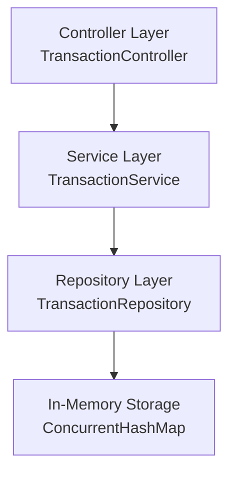

**Author:** Ivan Batura
# 🏦 Banking Transactions REST API

A robust, enterprise-grade **RESTful API** designed for managing and auditing banking transactions. This application provides a high-performance solution for financial transaction management, built on the **Spring Boot 3** framework and **Java 17**.

### 🌟 Overview
This API serves as a foundation for banking systems, offering core functionalities to handle financial flows with precision. It manages the full lifecycle of transactions—from creation and validation to advanced querying and reporting. Designed with scalability and maintainability in mind, it utilizes a multi-layered architecture and thread-safe in-memory storage, making it ideal for high-concurrency environments and rapid development.

### 💼 Core Business Capabilities
- **Comprehensive Transaction Lifecycle**: Supports Deposits, Withdrawals, and multi-account Transfers with atomic-like consistency.
- **Advanced Financial Intel**: Real-time balance tracking, account summaries, and automated interest calculation.
- **Data Governance**: Strict input validation, global error handling, and CSV export capabilities for auditing and external analysis.
- **Smart Query Engine**: Powerful filtering system to navigate transaction history by actors, types, and temporal ranges.


---

## 📋 Table of Contents

- [Features](#-features)
- [Architecture](#-architecture)
- [Technology Stack](#-technology-stack)
- [Project Structure](#-project-structure)
- [Quick Start](#-quick-start)
- [API Endpoints](#-api-endpoints)
- [Testing](#-testing)
- [Development Commands](#-development-commands)

---

## ✨ Features

- ✅ Create banking transactions (deposit, withdrawal, transfer)
- ✅ List all transactions
- ✅ **Filter transactions** by account ID, type, and date range ⭐ NEW
- ✅ Get transaction by ID
- ✅ Check account balance
- ✅ Input validation with meaningful error messages
- ✅ In-memory storage (no database required)
- ✅ RESTful API design with proper HTTP status codes
- ✅ Global exception handling

### 🆕 Transaction Filtering (NEW)
Filter transactions using query parameters:
- **By Account**: `?accountId=ACC-12345` - matches both sender and receiver
- **By Type**: `?type=TRANSFER` - filter by DEPOSIT, WITHDRAWAL, or TRANSFER
- **By Date Range**: `?from=2024-01-01T00:00:00Z&to=2024-01-31T23:59:59Z`
- **Combined**: Use any combination of filters together

📖 **[Complete Filtering Documentation](docs/features/transaction-filtering/INDEX.md)**

---

## 🏗 Architecture

The application follows a **layered architecture** pattern:



### Key Design Decisions

1. **Layered Architecture**: Separation of concerns with Controller → Service → Repository layers
2. **In-Memory Storage**: Using `ConcurrentHashMap` for thread-safe operations
3. **DTOs**: Separate Data Transfer Objects for API responses
4. **Global Exception Handler**: Centralized error handling with `@RestControllerAdvice`
5. **Bean Validation**: Jakarta validation annotations for automatic input validation
6. **Lombok**: Reduces boilerplate code for models and DTOs

---

## 🛠 Technology Stack

| Component           | Technology                    |
|---------------------|-------------------------------|
| Language            | Java 17                       |
| Framework           | Spring Boot 3.2.1             |
| Build Tool          | Gradle 8.10                   |
| Validation          | Jakarta Validation API        |
| Code Generation     | Lombok                        |
| Storage             | In-Memory (ConcurrentHashMap) |

---

## 📁 Project Structure

```
homework-1/
├── src/main/java/      # Application source code (Controller, Service, Repository, Model, DTO)
├── src/test/java/      # Unit and integration tests
├── src/main/resources/ # Application configuration and properties
├── demo/               # Sample scripts, request examples, and data files for testing
├── docs/               # Detailed documentation, feature guides, and screenshots
├── gradle/             # Gradle wrapper files
└── build/              # Generated build artifacts and reports
```

---

## 🚀 Quick Start

For detailed setup and run instructions, see **[HOWTORUN.md](HOWTORUN.md)**.

### Run the Application

```bash
# Option 1: Using the run script
cd homework-1
chmod +x demo/run.sh
./demo/run.sh

# Option 2: Using Gradle directly
./gradlew bootRun

# Option 3: Build and run JAR
./gradlew clean build
java -jar build/libs/transactions-api-1.0.0.jar
```

The API will be available at `http://localhost:8080/api`

---

## 📡 API Endpoints

### Base URL
```
http://localhost:8080/api
```

### Endpoints

| Method | Endpoint                           | Description                            |
|--------|------------------------------------|----------------------------------------|
| POST   | `/transactions`                    | Create a new transaction               |
| GET    | `/transactions`                    | Get all transactions (supports filters)|
| GET    | `/transactions/{id}`               | Get transaction by ID                  |
| GET    | `/accounts/{accountId}/balance`    | Get account balance                    |
| GET    | `/accounts/{accountId}/summary`    | Get account summary (totals)           |
| GET    | `/transactions/export`             | Export transactions as CSV             |
| GET    | `/accounts/{accountId}/interest`   | Calculate estimated interest           |

### Transaction Model

```json
{
  "id": "550e8400-e29b-41d4-a716-446655440000",
  "fromAccount": "ACC-12345",
  "toAccount": "ACC-67890",
  "amount": 100.50,
  "currency": "USD",
  "type": "TRANSFER",
  "timestamp": "2026-02-03T10:30:00Z",
  "status": "completed"
}
```

### Transaction Types (Enum)
- `DEPOSIT` - Add funds to an account
- `WITHDRAWAL` - Remove funds from an account
- `TRANSFER` - Move funds between accounts

### Status Codes
- `200 OK` - Successful GET request
- `201 Created` - Successful POST request
- `400 Bad Request` - Validation error
- `404 Not Found` - Resource not found
- `500 Internal Server Error` - Server error

---

## 🧪 Testing

For detailed testing instructions and examples, see the **[Testing section in HOWTORUN.md](HOWTORUN.md#-test-the-api)**.

### Using the Test Script

```bash
chmod +x demo/requests.sh
./demo/requests.sh
```

### Run Unit Tests

```bash
./gradlew test
```

View detailed test report:
```bash
open build/reports/tests/test/index.html
```

### Using curl

```bash
# Create a transaction
curl -X POST http://localhost:8080/api/transactions \
  -H "Content-Type: application/json" \
  -d '{
    "fromAccount": "ACC-12345",
    "toAccount": "ACC-67890",
    "amount": 100.50,
    "currency": "USD",
    "type": "TRANSFER"
  }'

# Get all transactions
curl http://localhost:8080/api/transactions

# Get account balance
curl http://localhost:8080/api/accounts/ACC-12345/balance
```

### Using HTTP Client
Open `demo/sample-requests.http` in VS Code (with REST Client extension) or IntelliJ IDEA and click "Send Request".

---

## 💻 Development Commands

```bash
# Clean and compile
./gradlew clean compileJava

# Run tests
./gradlew test

# Build JAR (skip tests)
./gradlew clean build -x test

# Run the application
./gradlew bootRun

# Run with specific port
./gradlew bootRun --args='--server.port=9090'

# Check dependencies
./gradlew dependencies

# View test report
open build/reports/tests/test/index.html
```

---


## 📄 License

This project is created for educational purposes as part of the AI Coding Partner Homework assignment.

---

**Built with ❤️ using AI-assisted development**
