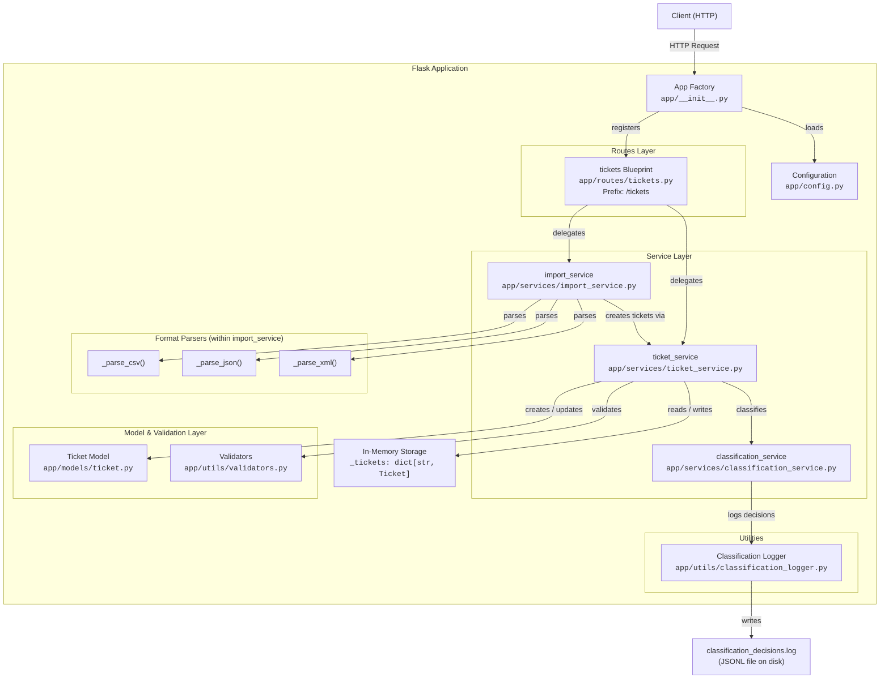

# Architecture Document -- Customer Support Ticket Management System

> **Audience:** Technical Leads
> **Last updated:** 2025-06-01
> **System version:** 1.0.0

---

## Table of Contents

1. [High-Level Architecture Diagram](#1-high-level-architecture-diagram)
2. [Component Descriptions](#2-component-descriptions)
3. [Data Flow Diagrams](#3-data-flow-diagrams)
4. [Design Decisions and Trade-offs](#4-design-decisions-and-trade-offs)
5. [Security and Performance Considerations](#5-security-and-performance-considerations)

---

## 1. High-Level Architecture Diagram

The system follows a classic layered architecture pattern. All components run within a single Flask process; there are no external services or databases.



### Directory Structure

```
homework-2/
├── app/
│   ├── __init__.py              # App factory (create_app)
│   ├── config.py                # Config classes (Dev, Prod)
│   ├── models/
│   │   ├── __init__.py
│   │   └── ticket.py            # Ticket data class
│   ├── routes/
│   │   ├── __init__.py
│   │   └── tickets.py           # Blueprint with all HTTP endpoints
│   ├── services/
│   │   ├── __init__.py
│   │   ├── ticket_service.py    # CRUD + business logic
│   │   ├── import_service.py    # Multi-format bulk import
│   │   └── classification_service.py  # Keyword-based auto-classification
│   └── utils/
│       ├── __init__.py
│       ├── validators.py        # Input validation helpers
│       └── classification_logger.py   # JSONL audit logger
├── tests/                       # Test suite
├── logs/                        # Classification decision logs (auto-created)
└── run.py                       # Application entry point
```

---

## 2. Component Descriptions

### 2.1 Flask App Factory (`app/__init__.py`)

The application uses the **Flask App Factory pattern** to enable flexible configuration and testability.

| Responsibility | Detail |
|---|---|
| Create Flask instance | `Flask(__name__)` |
| Load configuration | Reads `FLASK_ENV` env var, maps to `config_map` dict (`development`, `production`, `default`) |
| Register blueprints | Imports and registers `tickets_bp` from `app.routes.tickets` |

The factory function signature is:

```python
def create_app(config_name: str | None = None) -> Flask
```

When `config_name` is `None`, it falls back to `os.environ.get("FLASK_ENV", "default")`, which resolves to `DevelopmentConfig` (debug mode enabled, 16 MB upload limit).

### 2.2 Configuration (`app/config.py`)

Three configuration classes inherit from a base `Config`:

| Class | `DEBUG` | `MAX_CONTENT_LENGTH` | Usage |
|---|---|---|---|
| `Config` (base) | `False` | 16 MB | Shared defaults |
| `DevelopmentConfig` | `True` | 16 MB (inherited) | Local development |
| `ProductionConfig` | `False` | 16 MB (inherited) | Production deployment |

The `config_map` dictionary provides name-to-class resolution:

```python
config_map = {
    "development": DevelopmentConfig,
    "production": ProductionConfig,
    "default": DevelopmentConfig,
}
```

### 2.3 Routes Layer (`app/routes/tickets.py`)

A single Flask **Blueprint** named `"tickets"` exposes all HTTP endpoints. The blueprint does not use a `url_prefix` argument; instead, all routes are explicitly prefixed with `/tickets`.

| Method | Path | Handler | Description |
|---|---|---|---|
| `POST` | `/tickets` | `create_ticket()` | Create a single ticket (optional `auto_classify` flag) |
| `POST` | `/tickets/import` | `import_tickets()` | Bulk import from CSV, JSON, or XML file |
| `POST` | `/tickets/<id>/auto-classify` | `auto_classify_ticket()` | Run classification engine on existing ticket |
| `GET` | `/tickets` | `list_tickets()` | List all tickets with optional query-param filters |
| `GET` | `/tickets/<id>` | `get_ticket()` | Retrieve a single ticket by UUID |
| `PUT` | `/tickets/<id>` | `update_ticket()` | Partial update (triggers `manual_override` on category/priority change) |
| `DELETE` | `/tickets/<id>` | `delete_ticket()` | Delete a ticket by UUID |

**Key route-level behaviors:**

- **JSON parsing:** Uses `request.get_json(silent=True)` and returns 400 if body is not valid JSON.
- **Format detection for import:** A three-tier cascade: (1) `?format=` query param, (2) uploaded file extension, (3) `Content-Type` header. The `_FORMAT_MAP` dict normalizes MIME types and extensions to internal format names (`csv`, `json`, `xml`).
- **Partial import status codes:** Returns `200` for full or partial success; returns `400` only when every record fails.
- **Filter whitelist:** Only `status`, `priority`, `category`, `assigned_to`, and `customer_email` are accepted as filter parameters.

### 2.4 Service Layer

#### 2.4.1 Ticket Service (`app/services/ticket_service.py`)

The central business logic module. Manages the in-memory ticket store (`_tickets: dict[str, Ticket]`) and orchestrates validation, persistence, and classification.

| Function | Signature | Description |
|---|---|---|
| `reset_store()` | `() -> None` | Clears all tickets (used in test teardown) |
| `create_ticket()` | `(data, auto_classify=False) -> (dict, list[str])` | Validate, create `Ticket`, optionally classify |
| `get_ticket()` | `(ticket_id) -> dict \| None` | Lookup by ID |
| `get_all_tickets()` | `(filters=None) -> list[dict]` | Return all tickets, apply optional attribute filters |
| `update_ticket()` | `(ticket_id, data) -> (dict \| None, list[str])` | Validate and apply partial update |
| `auto_classify_ticket()` | `(ticket_id) -> (dict \| None, dict \| None)` | Classify existing ticket, apply results |
| `delete_ticket()` | `(ticket_id) -> bool` | Remove ticket from store |

**Filtering implementation:** Sequential list comprehension filters on each supplied key. This is O(n) per filter, O(n * f) total, where n = number of tickets and f = number of active filters.

#### 2.4.2 Import Service (`app/services/import_service.py`)

Handles multi-format bulk ticket import with partial success semantics.

| Function | Visibility | Description |
|---|---|---|
| `import_tickets()` | Public | Entry point: dispatches to correct parser, then processes records |
| `_parse_csv()` | Private | Decodes UTF-8 (with BOM support), uses `csv.DictReader`, handles semicolon-delimited tags and dot-notation metadata fields |
| `_parse_json()` | Private | Accepts a JSON array or `{"tickets": [...]}` wrapper |
| `_parse_xml()` | Private | Parses `<tickets><ticket>...</ticket></tickets>` structure with nested `<tags>` and `<metadata>` elements |
| `_process_records()` | Private | Iterates parsed records, calls `ticket_service.create_ticket()` per record, collects per-row errors |

**Parser dispatch** uses a dictionary mapping format names to parser functions:

```python
_PARSERS = {
    "csv": _parse_csv,
    "json": _parse_json,
    "xml": _parse_xml,
}
```

**Return structure:**

```json
{
    "total": 10,
    "successful": 8,
    "failed": 2,
    "errors": [
        {"row": 3, "errors": ["customer_email is required"]},
        {"row": 7, "errors": ["Invalid email format"]}
    ]
}
```

#### 2.4.3 Classification Service (`app/services/classification_service.py`)

A deterministic, keyword-based classification engine that assigns both a category and a priority to a ticket based on its subject and description text.

**Keyword Dictionaries:**

| Dictionary | Keys | Keyword Count (approx.) |
|---|---|---|
| `CATEGORY_KEYWORDS` | `account_access`, `technical_issue`, `billing_question`, `feature_request`, `bug_report` | ~70 keywords/phrases |
| `PRIORITY_KEYWORDS` | `urgent`, `high`, `low` | ~30 keywords/phrases |

**Scoring Algorithm:**

1. Build searchable text: `f"{subject.lower()} {description.lower()}"`
2. For each category/priority, scan all keywords against the text (substring match, case-insensitive)
3. Accumulate a score per keyword match:
   - Single-word keyword: **+0.20** (`_BASE_WEIGHT`)
   - Multi-word phrase (contains a space): **+0.30** (`_LONG_PHRASE_WEIGHT`)
4. The category/priority with the highest cumulative score wins
5. **Defaults:** If no category matches, result is `"other"`. If no priority matches, result is `"medium"` with confidence `1.0`.
6. **Overall confidence:** `min(1.0, category_score * 0.70 + priority_score * 0.30)`
7. **Reasoning:** Human-readable string describing the decision, including confidence level labels: `high` (>= 0.70), `medium` (>= 0.40), `low` (< 0.40).

Every classification decision is logged via `classification_logger.log_classification_decision()`.

### 2.5 Model Layer (`app/models/ticket.py`)

The `Ticket` class represents a single support ticket in memory.

**Fields:**

| Field | Type | Default | Notes |
|---|---|---|---|
| `id` | `str` | `uuid.uuid4()` | Auto-generated UUID |
| `customer_id` | `str` | Required | |
| `customer_email` | `str` | Required | Validated via regex |
| `customer_name` | `str` | Required | |
| `subject` | `str` | Required | 1--200 characters |
| `description` | `str` | Required | 10--2000 characters |
| `category` | `str` | Required | Enum: 6 valid values |
| `priority` | `str` | Required | Enum: `urgent`, `high`, `medium`, `low` |
| `status` | `str` | `"new"` | Enum: 5 valid values |
| `created_at` | `str` | `now()` | ISO-8601 UTC |
| `updated_at` | `str` | `now()` | Refreshed on every update |
| `resolved_at` | `str \| None` | `None` | Auto-set on status `resolved`/`closed` |
| `assigned_to` | `str \| None` | `None` | |
| `tags` | `list[str]` | `[]` | |
| `metadata` | `dict` | `{}` | Arbitrary key-value pairs (validated sub-fields: `source`, `device_type`) |
| `classification_confidence` | `float \| None` | `None` | Set by auto-classify |
| `classification_reasoning` | `str \| None` | `None` | Set by auto-classify |
| `classification_keywords` | `list[str]` | `[]` | Set by auto-classify |
| `classified_at` | `str \| None` | `None` | Set by auto-classify |
| `manual_override` | `bool` | `False` | Set to `True` when user manually changes category or priority via `update()` |

**Key methods:**

- `to_dict()` -- Serializes all fields to a plain dictionary for JSON responses.
- `update(data)` -- Applies partial updates. Detects `manual_override` when `category` or `priority` is explicitly changed. Auto-sets `resolved_at` on status transition to `resolved` or `closed`.
- `apply_classification(result)` -- Updates classification fields from a classification result dict. Does **not** set `manual_override`.

### 2.6 Utils Layer

#### 2.6.1 Validators (`app/utils/validators.py`)

Provides composable validation functions and a top-level `validate_ticket_data()` orchestrator.

| Function | Purpose |
|---|---|
| `validate_email(email)` | RFC 5322 simplified regex: `^[a-zA-Z0-9_.+-]+@[a-zA-Z0-9-]+\.[a-zA-Z0-9-.]+$` |
| `validate_string_length(value, field_name, min_len, max_len)` | Checks stripped string length against bounds |
| `validate_enum(value, field_name, allowed)` | Checks membership in a set of allowed values |
| `validate_ticket_data(data, is_update=False)` | Composite validator that checks all fields, returns list of error strings |

**Validation rules on creation vs. update:**

- **Creation (`is_update=False`):** All 7 required fields must be present and non-empty.
- **Update (`is_update=True`):** Only supplied fields are validated. Missing fields are not flagged.

**Enum sets:**

| Enum | Valid Values |
|---|---|
| Categories | `account_access`, `technical_issue`, `billing_question`, `feature_request`, `bug_report`, `other` |
| Priorities | `urgent`, `high`, `medium`, `low` |
| Statuses | `new`, `in_progress`, `waiting_customer`, `resolved`, `closed` |
| Sources (metadata) | `web_form`, `email`, `api`, `chat`, `phone` |
| Device types (metadata) | `desktop`, `mobile`, `tablet` |

#### 2.6.2 Classification Logger (`app/utils/classification_logger.py`)

Writes structured JSONL (one JSON object per line) to `logs/classification_decisions.log`.

**Configuration:**

- Log directory is configurable via `CLASSIFY_LOG_DIR` environment variable (default: `logs/`).
- Uses a dedicated Python logger named `"classification"` to avoid mixing with Flask's application logs.
- The handler uses `logging.Formatter("%(message)s")` so each line is pure JSON with no log-framework preamble.

**Log entry schema:**

```json
{
    "timestamp": "2025-06-01T14:30:00.000000+00:00",
    "ticket_id": "a1b2c3d4-...",
    "category": "technical_issue",
    "priority": "high",
    "confidence": 0.62,
    "reasoning": "Category set to 'technical_issue' based on keyword matches: ...",
    "keywords_found": ["error", "not working", "crash"]
}
```

---

## 3. Data Flow Diagrams

### 3.1 Ticket Import Flow

This sequence diagram illustrates the full lifecycle of a bulk import request, from file upload through format detection, parsing, per-record validation, and partial-success response.


### 3.2 Auto-Classification Flow

This sequence diagram shows how a ticket is classified, from the initial API call through keyword matching, confidence scoring, decision logging, and ticket update.


---

## 4. Design Decisions and Trade-offs

### 4.1 In-Memory Storage vs. Database

| | In-Memory Dict | Database (e.g., PostgreSQL) |
|---|---|---|
| **Chosen** | Yes | No |
| **Complexity** | Zero setup, no connection management | Requires driver, migrations, connection pool |
| **Performance** | O(1) reads/writes by key | Network round-trip per query |
| **Persistence** | Lost on process restart | Durable across restarts |
| **Concurrency** | Not safe under multi-process | ACID guarantees |
| **Scalability** | Single-process only | Horizontal read replicas |

**Rationale:** The in-memory dict (`_tickets: dict[str, Ticket]`) was chosen for simplicity and zero external dependencies. The system is a demonstration/prototype; persistence and multi-process safety are out of scope. Migrating to a database would primarily affect `ticket_service.py` (replace dict operations with ORM calls) and would not require changes to routes or classification logic due to the layered architecture.

### 4.2 Keyword-Based Classification vs. Machine Learning

| | Keyword Matching | ML (e.g., fine-tuned BERT) |
|---|---|---|
| **Chosen** | Yes | No |
| **Accuracy** | Moderate (depends on keyword coverage) | High (after training) |
| **Explainability** | Fully transparent: exact keywords listed | Opaque without SHAP/LIME |
| **Latency** | Microseconds | Milliseconds to seconds (model inference) |
| **Maintenance** | Edit keyword lists | Retrain model with new data |
| **Dependencies** | None | PyTorch/TensorFlow, model weights |

**Rationale:** Keyword matching produces deterministic, fully explainable results. Every classification decision includes the exact keywords that triggered it, which is critical for support team trust and auditability. The trade-off is lower accuracy on ambiguous tickets, but the confidence score and "manual review recommended" label mitigate this by flagging uncertain decisions.

### 4.3 Partial Import Success

**Decision:** When importing a batch of tickets, valid records are persisted even when other records in the same batch fail validation.

**Alternative:** All-or-nothing (transaction-style) import where any single failure rolls back the entire batch.

**Rationale:** Partial success provides a better user experience for large imports where a few records may have data quality issues. The response includes detailed per-row error reporting (`{"row": 3, "errors": [...]}`) so the user knows exactly which records failed and why. The HTTP status code reflects the outcome: `200` for full or partial success, `400` only when every record fails.

### 4.4 Layered Architecture (Routes -> Services -> Models)

**Decision:** Strict separation of concerns across three layers:

- **Routes:** HTTP concerns only (request parsing, response serialization, status codes)
- **Services:** Business logic (validation orchestration, storage operations, classification)
- **Models:** Data representation and field-level behavior

**Trade-off:** More files and some boilerplate compared to putting logic directly in route handlers. However, this yields:

- **Testability:** Services can be unit-tested without HTTP/Flask, models without services.
- **Maintainability:** Changing storage mechanism only touches the service layer.
- **Readability:** Each module has a single, clear responsibility.

### 4.5 Flask over FastAPI

| | Flask | FastAPI |
|---|---|---|
| **Chosen** | Yes | No |
| **Async support** | No (WSGI) | Yes (ASGI) |
| **Auto OpenAPI docs** | No (requires Flask-RESTX or similar) | Yes (built-in Swagger UI) |
| **Type validation** | Manual (custom validators) | Pydantic models auto-validate |
| **Ecosystem maturity** | Very mature, huge community | Rapidly growing |

**Rationale:** Flask was chosen for its simplicity, minimal boilerplate, and wide adoption. The system does not require async I/O (no database, no external API calls), so ASGI provides no benefit. The custom validation layer (`validators.py`) provides explicit control over error messages and validation behavior. The trade-off is the absence of automatic OpenAPI documentation and Pydantic integration.

### 4.6 Confidence Scoring Algorithm

**Decision:** Weighted combination formula: `confidence = min(1.0, category_score * 0.70 + priority_score * 0.30)`

**Design choices within the algorithm:**

- **70/30 weighting:** Category classification is weighted more heavily because it is the primary classification dimension and harder to get right. Priority often has a natural default (`medium`).
- **Base weight 0.20 per single keyword:** Each short keyword match adds moderate confidence.
- **Phrase weight 0.30 per multi-word phrase:** Multi-word phrases (e.g., "steps to reproduce", "production down") are more specific and thus contribute more confidence.
- **Cap at 1.0:** Prevents confidence from exceeding 100%.
- **Default priority confidence of 1.0:** When no priority keywords match, the "medium" default is assigned with full confidence, as "medium" is a safe default.

**Trade-off:** The weights are hand-tuned and may need adjustment for real-world ticket distributions. A data-driven approach (learning weights from labeled examples) would be more robust but adds significant complexity.

### 4.7 Classification Logging (JSONL Audit Trail)

**Decision:** Every auto-classification decision is logged to a JSONL file (`logs/classification_decisions.log`) with timestamp, ticket ID, result, reasoning, and matched keywords.

**Why JSONL:**

- One JSON object per line -- easy to parse with standard tools (`jq`, Python `json`)
- Append-only -- no risk of corrupting existing entries
- Structured -- enables programmatic analysis and reporting
- Human-readable -- support for manual audit

**Trade-off:** File I/O on every classification adds latency (typically < 1ms for buffered writes). In a production system, this could be replaced with a message queue (e.g., Kafka) or a centralized logging service (e.g., ELK stack). The dedicated Python logger (`"classification"`) with a separate `FileHandler` ensures classification logs do not interleave with Flask application logs.

---

## 5. Security and Performance Considerations

### 5.1 Security

#### Implemented

| Measure | Implementation | Location |
|---|---|---|
| **Input validation** | All required fields checked; email regex, string length bounds, enum membership | `app/utils/validators.py` |
| **File upload size limit** | `MAX_CONTENT_LENGTH = 16 * 1024 * 1024` (16 MB) | `app/config.py` |
| **UTF-8 encoding handling** | CSV parser uses `utf-8-sig` codec to handle BOM (Byte Order Mark) | `app/services/import_service.py` |
| **XML parsing** | Uses `xml.etree.ElementTree` (standard library) | `app/services/import_service.py` |
| **Enum whitelists** | Category, priority, status, source, and device_type are validated against closed sets | `app/utils/validators.py` |
| **No SQL injection surface** | No database means no SQL injection vector | N/A |

#### Not Implemented (Out of Scope)

| Measure | Risk | Mitigation Path |
|---|---|---|
| **Authentication / Authorization** | Any client can CRUD any ticket | Add JWT or API key middleware |
| **Rate limiting** | Vulnerable to DoS via bulk requests | Add `flask-limiter` or API gateway rate limiting |
| **CORS policy** | Browser-based clients from any origin can call the API | Add `flask-cors` with appropriate `Access-Control-Allow-Origin` |
| **HTTPS / TLS** | Data transmitted in plaintext | Deploy behind a reverse proxy (nginx, Caddy) with TLS termination |
| **XML External Entity (XXE) prevention** | `ElementTree` is generally safe but `defusedxml` is recommended for production | Replace `ET` with `defusedxml.ElementTree` |
| **Request body size validation per field** | Very large strings within the 16 MB limit could consume memory | Add per-field max-length validation (partially done for `subject` and `description`) |

### 5.2 Performance

#### Time Complexity Analysis

| Operation | Complexity | Notes |
|---|---|---|
| Create ticket | O(v) | v = number of validation checks (~15) |
| Get ticket by ID | O(1) | Direct dict lookup |
| List all tickets (no filters) | O(n) | n = total ticket count; iterates all values |
| List with filters | O(n * f) | f = number of active filters (max 5) |
| Delete ticket | O(1) | Direct dict deletion |
| Keyword classification | O(k * t) | k = total keywords (~100), t = text length (substring search) |
| Bulk import (m records) | O(m * v) | m records, each validated |

#### Space Complexity

| Component | Memory | Notes |
|---|---|---|
| Ticket storage | O(n) | n = number of tickets, each ~2 KB |
| Keyword dictionaries | O(k) | ~100 keywords, loaded once at import time |
| Import parsing | O(m) | m = number of records in file (all loaded into memory) |

#### Performance Characteristics

| Aspect | Current Behavior | Production Recommendation |
|---|---|---|
| **Storage** | In-memory dict; O(1) read/write by ID | Migrate to PostgreSQL with indexed queries |
| **File parsing** | CSV: streaming via `DictReader`; JSON/XML: full load into memory | Add streaming JSON parser for large files; consider SAX for XML |
| **Upload limit** | 16 MB hard cap via Flask config | Sufficient for most bulk imports; consider chunked upload for larger datasets |
| **Classification** | Synchronous, in-process | For ML-based classification, offload to async worker (Celery) |
| **Logging** | Synchronous file I/O | Replace with async logging handler or centralized log service |
| **Concurrency** | Single-threaded WSGI | Deploy with Gunicorn (multiple workers) behind nginx |
| **Connection pooling** | Not applicable (no database) | Add connection pool when migrating to a database |

#### Bottleneck Analysis

1. **Filtering (O(n)):** As ticket count grows, linear scan becomes expensive. Mitigation: add database with indexed columns.
2. **Bulk import with large files:** JSON and XML parsers load the entire file into memory. A 16 MB JSON file with many small tickets could create thousands of objects. Mitigation: streaming parser or chunked processing.
3. **Classification keyword matching:** Substring search across ~100 keywords for each classification. Currently negligible but would not scale with thousands of keywords. Mitigation: precompile keywords into a trie or Aho-Corasick automaton.

---

*This document describes the architecture as of the initial release. It should be updated as the system evolves, particularly if a persistent storage layer, authentication, or ML-based classification is added.*
