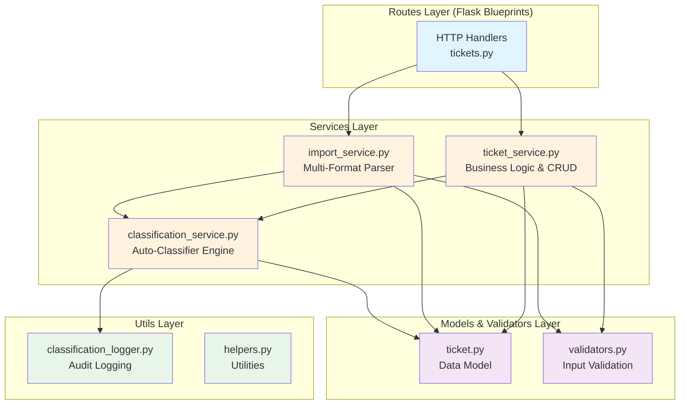

# Customer Support Ticket Management System

A production-ready support ticket management system built with Python and Flask that provides intelligent ticket classification, multi-format data import capabilities, and comprehensive RESTful API endpoints.

## Project Overview and Features

This system is designed to streamline customer support operations by providing automated ticket management capabilities. Built with Python and Flask, it offers a robust backend for handling support tickets with the following core capabilities:

- **Multi-Format Data Import**: Import tickets from CSV, JSON, and XML files with automatic parsing and validation
- **Intelligent Auto-Classification**: Keyword-based classification engine that automatically categorizes tickets into Technical, Billing, General, or Feature Request categories
- **Priority Assignment**: Automatic priority assignment (Low, Medium, High, Critical) based on content analysis
- **REST API**: Full CRUD operations with advanced filtering and bulk operations
- **Audit Logging**: Complete classification decision tracking with confidence scores for compliance and debugging
- **Partial Success Handling**: Robust error handling that allows successful records to be processed even when some fail
- **Comprehensive Validation**: Input validation at multiple layers to ensure data integrity

## Architecture Diagram

The system follows a layered architecture pattern with clear separation of concerns:



## Installation and Setup Instructions

### Prerequisites

- Python 3.11 or higher
- pip (Python package manager)
- Git

### Setup Steps

1. **Clone the repository**
   ```bash
   git clone <repository-url>
   cd AI-Coding-Partner-Homework/homework-2
   ```

2. **Create and activate a virtual environment**
   ```bash
   python -m venv venv
   source venv/bin/activate  # On Windows: venv\Scripts\activate
   ```

3. **Install dependencies**
   ```bash
   pip install -r requirements.txt
   ```

4. **Run the application**
   ```bash
   python run.py
   ```

   The application will start on `http://localhost:5000`

### Optional Environment Variables

Configure the application behavior using these environment variables:

- `FLASK_ENV`: Set to `development` or `production` (default: `development`)
- `CLASSIFY_LOG_DIR`: Directory path for classification audit logs (default: `logs/`)

Example:
```bash
export FLASK_ENV=production
export CLASSIFY_LOG_DIR=/var/log/ticket-system/
python run.py
```

## How to Run Tests

The project includes a comprehensive test suite with 95% code coverage across 56 tests.

### Run All Tests with Coverage

```bash
pytest tests/ -v --cov=app --cov-report=term-missing
```

### Run Specific Test File

```bash
pytest tests/test_ticket_api.py -v
```

### Generate HTML Coverage Report

```bash
pytest tests/ --cov=app --cov-report=html
```

The HTML report will be generated in the `htmlcov/` directory. Open `htmlcov/index.html` in a browser to view detailed coverage metrics.

### Run Specific Test Categories

```bash
# Run only API tests
pytest tests/test_ticket_api.py -v

# Run only import tests
pytest tests/test_import_csv.py tests/test_import_json.py tests/test_import_xml.py -v

# Run only classification tests
pytest tests/test_categorization.py -v

# Run integration tests
pytest tests/test_integration.py -v

# Run performance benchmarks
pytest tests/test_performance.py -v
```

### Coverage Target

The project maintains a coverage target of >85%, with current coverage at approximately 95%.

## Project Structure

```
homework-2/
├── run.py                        # Application entry point
├── requirements.txt              # Python dependencies
├── app/
│   ├── __init__.py              # Flask app factory
│   ├── config.py                # Configuration (Dev/Prod)
│   ├── models/
│   │   └── ticket.py            # Ticket data model
│   ├── routes/
│   │   └── tickets.py           # REST API endpoints
│   ├── services/
│   │   ├── ticket_service.py    # Business logic (CRUD)
│   │   ├── import_service.py    # Multi-format parser (CSV/JSON/XML)
│   │   └── classification_service.py  # Auto-classifier engine
│   └── utils/
│       ├── validators.py        # Input validation
│       └── classification_logger.py   # Decision audit logging
├── tests/
│   ├── conftest.py              # Pytest fixtures
│   ├── test_ticket_model.py     # Model unit tests
│   ├── test_ticket_api.py       # API endpoint tests
│   ├── test_import_csv.py       # CSV import tests
│   ├── test_import_json.py      # JSON import tests
│   ├── test_import_xml.py       # XML import tests
│   ├── test_categorization.py   # Classification tests
│   ├── test_integration.py      # End-to-end tests
│   ├── test_performance.py      # Performance benchmarks
│   └── fixtures/                # Test data files
└── docs/
    └── screenshots/             # Documentation screenshots
```

## Key Features

- **REST API with 7 endpoints**: Complete CRUD operations plus bulk import and auto-classification
- **Multi-format import (CSV, JSON, XML)**: Flexible data ingestion with partial success support
- **Keyword-based auto-classification**: Intelligent categorization with confidence scoring
- **Comprehensive input validation**: Multi-layer validation ensures data integrity
- **Classification decision audit logging (JSONL)**: Complete audit trail for compliance and debugging
- **Advanced filtering capabilities**: Filter by category, priority, status, assigned agent, and customer email
- **Manual override tracking**: Track when classifications are manually overridden by agents
- **95% test coverage across 56 tests**: Extensive test suite covering unit, integration, and performance tests
- **In-memory storage**: No external database required for quick setup and testing
- **Partial success handling**: Bulk operations continue processing valid records even when some fail
- **Confidence scoring**: Classification engine provides confidence metrics for each categorization

## Tech Stack

- **Python 3.11+**: Modern Python with type hints and latest language features
- **Flask 3.1.0**: Lightweight and flexible web framework
- **pytest 8.3.4**: Advanced testing framework with fixtures and parametrization
- **pytest-cov 6.0.0**: Code coverage plugin for pytest
- **In-memory storage**: No external database required (production systems should integrate with PostgreSQL, MySQL, etc.)

## Quick Start

### Create a Single Ticket

Use cURL to create a new support ticket:

```bash
curl -X POST http://localhost:5000/api/tickets \
  -H "Content-Type: application/json" \
  -d '{
    "customer_name": "John Doe",
    "customer_email": "john.doe@example.com",
    "description": "My application keeps crashing when I try to export data. Getting error code 500.",
    "status": "open"
  }'
```

Response:
```json
{
  "id": "550e8400-e29b-41d4-a716-446655440000",
  "customer_name": "John Doe",
  "customer_email": "john.doe@example.com",
  "description": "My application keeps crashing when I try to export data. Getting error code 500.",
  "category": "Technical",
  "priority": "High",
  "status": "open",
  "assigned_agent": null,
  "created_at": "2026-02-08T10:30:00Z",
  "updated_at": "2026-02-08T10:30:00Z"
}
```

### Import Tickets from CSV

Create a CSV file (`tickets.csv`):

```csv
customer_name,customer_email,description,status
Jane Smith,jane.smith@example.com,I was charged twice for my subscription this month,open
Bob Wilson,bob.wilson@example.com,Can you add support for dark mode in the mobile app?,open
Alice Johnson,alice.j@example.com,How do I reset my password?,open
```

Import the tickets:

```bash
curl -X POST http://localhost:5000/api/tickets/import/csv \
  -F "file=@tickets.csv"
```

Response:
```json
{
  "imported_count": 3,
  "failed_count": 0,
  "tickets": [
    {
      "id": "660e8400-e29b-41d4-a716-446655440001",
      "customer_name": "Jane Smith",
      "category": "Billing",
      "priority": "High"
    },
    {
      "id": "770e8400-e29b-41d4-a716-446655440002",
      "customer_name": "Bob Wilson",
      "category": "Feature Request",
      "priority": "Low"
    },
    {
      "id": "880e8400-e29b-41d4-a716-446655440003",
      "customer_name": "Alice Johnson",
      "category": "General",
      "priority": "Medium"
    }
  ]
}
```

### Get All Tickets with Filtering

```bash
# Get all tickets
curl http://localhost:5000/api/tickets

# Filter by category
curl http://localhost:5000/api/tickets?category=Technical

# Filter by priority
curl http://localhost:5000/api/tickets?priority=High

# Filter by status
curl http://localhost:5000/api/tickets?status=open

# Combine filters
curl http://localhost:5000/api/tickets?category=Billing&priority=High&status=open
```

### Update a Ticket

```bash
curl -X PUT http://localhost:5000/api/tickets/550e8400-e29b-41d4-a716-446655440000 \
  -H "Content-Type: application/json" \
  -d '{
    "status": "in_progress",
    "assigned_agent": "agent@support.com"
  }'
```

### Delete a Ticket

```bash
curl -X DELETE http://localhost:5000/api/tickets/550e8400-e29b-41d4-a716-446655440000
```

## API Endpoints

| Method | Endpoint | Description |
|--------|----------|-------------|
| GET | `/api/tickets` | List all tickets with optional filtering |
| GET | `/api/tickets/<id>` | Get a specific ticket by ID |
| POST | `/api/tickets` | Create a new ticket |
| PUT | `/api/tickets/<id>` | Update an existing ticket |
| DELETE | `/api/tickets/<id>` | Delete a ticket |
| POST | `/api/tickets/import/csv` | Bulk import tickets from CSV file |
| POST | `/api/tickets/import/json` | Bulk import tickets from JSON file |
| POST | `/api/tickets/import/xml` | Bulk import tickets from XML file |

## Classification System

The auto-classification engine uses keyword matching with confidence scoring:

### Categories

- **Technical**: Keywords like "error", "crash", "bug", "not working", "broken"
- **Billing**: Keywords like "charge", "payment", "invoice", "refund", "subscription"
- **Feature Request**: Keywords like "feature", "add", "enhancement", "suggestion", "could you"
- **General**: Default category when no specific keywords match

### Priority Levels

- **Critical**: Keywords like "critical", "urgent", "emergency", "down"
- **High**: Keywords like "error", "crash", "not working", "broken"
- **Medium**: Keywords like "issue", "problem", "help"
- **Low**: Default priority for feature requests and general inquiries

### Confidence Scoring

Each classification includes a confidence score (0.0 - 1.0) based on:
- Number of matching keywords
- Keyword strength/relevance
- Description length and quality

## Audit Logging

All classification decisions are logged in JSONL format for audit purposes:

```json
{
  "ticket_id": "550e8400-e29b-41d4-a716-446655440000",
  "timestamp": "2026-02-08T10:30:00Z",
  "category": "Technical",
  "priority": "High",
  "confidence": 0.85,
  "keywords_matched": ["error", "crash", "not working"],
  "manually_overridden": false
}
```

## Contributing

This is a homework project. For production use, consider adding:

- Persistent database integration (PostgreSQL, MySQL)
- Authentication and authorization
- Rate limiting
- Pagination for large datasets
- WebSocket support for real-time updates
- Machine learning-based classification
- Email notification system
- Attachment support
- Advanced search capabilities

## License

This project is part of the AI Coding Partner Homework assignment.
