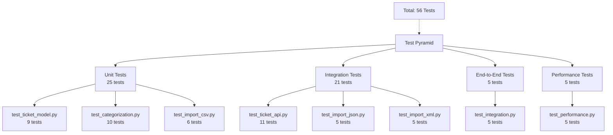

# Testing Guide - Customer Support Ticket Management System

This guide provides QA Engineers with comprehensive instructions for testing the Customer Support Ticket Management System. It covers test organization, execution, manual testing procedures, and performance benchmarks.

---

## 1. Test Pyramid Diagram

The test suite is organized following the testing pyramid model, with a focus on unit tests at the base, integration tests in the middle, and a smaller set of end-to-end tests at the top. Performance tests are maintained as a separate track.



### Test Distribution Summary

| Test Category | Count | Files | Coverage |
|---|---|---|---|
| Unit Tests | 25 | 3 files | Core logic & models |
| Integration Tests | 21 | 3 files | API & import functionality |
| End-to-End Tests | 5 | 1 file | Complete workflows |
| Performance Tests | 5 | 1 file | Benchmarks & throughput |
| **TOTAL** | **56** | **8 files** | **Comprehensive** |

---

## 2. How to Run Tests

### Prerequisites

Before running tests, ensure your environment is properly configured:

- **Python Version**: Python 3.11 or higher
- **Dependencies**: All packages from requirements.txt installed
- **Installation**:
  ```bash
  pip install -r requirements.txt
  ```

### Test Execution Commands

#### Run All Tests with Verbose Output
```bash
pytest tests/ -v
```
Shows all test names and their pass/fail status. Useful for seeing which tests ran and their individual results.

#### Run All Tests with Coverage Report (Terminal)
```bash
pytest tests/ -v --cov=app --cov-report=term-missing
```
Displays code coverage statistics in the terminal, highlighting which lines are not covered by tests. Aim for >90% coverage.

#### Run a Specific Test File
```bash
pytest tests/test_ticket_api.py -v
```
Executes only tests from the specified file. Use this when working on a specific feature.

#### Run Tests by Name Pattern
```bash
pytest tests/ -k "test_create_ticket" -v
```
Runs all tests whose names match the given pattern. Useful for testing related functionality across multiple files.

#### Generate HTML Coverage Report
```bash
pytest tests/ --cov=app --cov-report=html
# Then open htmlcov/index.html in your browser
```
Creates a detailed HTML report showing line-by-line coverage. Perfect for identifying untested code paths.

#### Run Fast Tests Only (Exclude Performance Tests)
```bash
pytest tests/ -v --ignore=tests/test_performance.py
```
Executes all tests except performance benchmarks. Use during rapid development cycles.

#### Run with Detailed Output and Print Statements
```bash
pytest tests/ -v -s
```
Shows verbose output with any print statements and logging. Useful for debugging test failures.

#### Run Only Performance Tests
```bash
pytest tests/test_performance.py -v
```
Executes only performance and benchmark tests to validate system responsiveness.

---

## 3. Sample Test Data Locations

Test fixtures provide consistent, repeatable data for validation. All fixtures are located in the `tests/fixtures/` directory.

### CSV Fixtures

**tests/fixtures/valid_tickets.csv**
- Contains 3 valid, complete ticket records
- Includes all required fields: customer_name, customer_email, subject, description, category, priority
- Optional fields: assigned_to, tags (semicolon-separated), metadata (dot notation)
- Use case: Testing CSV import success path

**tests/fixtures/invalid_tickets.csv**
- Contains records with various validation failures:
  - Missing required fields (blank subject, empty description)
  - Invalid email format (missing @, invalid domain)
  - Wrong enum values (invalid category, out-of-range priority)
  - Incomplete data rows
- Use case: Testing CSV error handling and validation

### JSON Fixtures

**tests/fixtures/valid_tickets.json**
- Contains 2 valid ticket records in wrapped format: `{"tickets": [...]}`
- Alternative format (array) also tested: `[{...}, {...}]`
- Includes all required and optional fields
- Use case: Testing JSON import in both array and object-wrapped formats

**tests/fixtures/invalid_tickets.json**
- Contains records with JSON-specific validation issues:
  - Invalid email addresses
  - Empty required fields (subject, description)
  - Wrong category or priority values
  - Malformed JSON structure
- Use case: Testing JSON parsing error handling

### XML Fixtures

**tests/fixtures/valid_tickets.xml**
- Contains multiple valid ticket records with proper XML structure
- Includes nested metadata elements and tag elements
- Example structure:
  ```xml
  <tickets>
    <ticket>
      <customer_name>Name</customer_name>
      <customer_email>email@example.com</customer_email>
      ...
      <metadata>
        <key>value</key>
      </metadata>
      <tags>
        <tag>tag1</tag>
        <tag>tag2</tag>
      </tags>
    </ticket>
  </tickets>
  ```
- Use case: Testing XML import with nested elements

**tests/fixtures/invalid_tickets.xml**
- Contains malformed and invalid XML:
  - Unclosed tags
  - Invalid character escaping
  - Missing required fields in XML structure
  - Invalid enum values
- Use case: Testing XML parsing robustness

### Pytest Configuration and Fixtures

**tests/conftest.py**
- Provides reusable pytest fixtures for all test files:
  - `app`: Flask application instance configured for testing
  - `client`: Test client for making HTTP requests
  - `sample_ticket_data`: Sample ticket dictionaries for quick test setup
  - Auto-reset mechanisms to ensure clean state between tests
  - Database/storage clearing before each test

---

## 4. Manual Testing Checklist

Use this checklist when performing manual testing or validating QA scenarios outside of automated tests. Mark items as complete when verified.

### Ticket CRUD Operations

#### Create Ticket
- [ ] **Create ticket with all required fields** → Returns HTTP 201 with created ticket ID
- [ ] **Create ticket missing required field** → Returns HTTP 400 with descriptive error message
- [ ] **Create ticket with invalid email format** → Returns HTTP 400 with validation error
- [ ] **Create ticket with unknown category** → Returns HTTP 400 with available categories listed
- [ ] **Create ticket with invalid priority level** → Returns HTTP 400 with valid priority range

#### Read Ticket
- [ ] **Get all tickets** → Returns HTTP 200 with array of all tickets
- [ ] **Get ticket by valid ID** → Returns HTTP 200 with correct ticket data
- [ ] **Get ticket by invalid ID** → Returns HTTP 404 "Not Found"
- [ ] **Get ticket by non-existent ID** → Returns HTTP 404 with appropriate message

#### Update Ticket
- [ ] **Update single ticket field** → Returns HTTP 200 with updated data
- [ ] **Update multiple fields** → Returns HTTP 200 with all changes reflected
- [ ] **Update with invalid data** → Returns HTTP 400 with validation error
- [ ] **Update ticket status** → Returns HTTP 200, status changes correctly
- [ ] **Update non-existent ticket** → Returns HTTP 404

#### Delete Ticket
- [ ] **Delete existing ticket** → Returns HTTP 200, ticket no longer retrievable
- [ ] **Delete non-existent ticket** → Returns HTTP 404
- [ ] **Verify deleted ticket not in list** → GET /tickets excludes deleted ticket

### Import Operations

#### CSV Import
- [ ] **Import valid CSV file** → Returns HTTP 200 with success count for all rows
- [ ] **Import CSV with mixed valid/invalid records** → Returns HTTP 200 with partial success details
- [ ] **Import CSV with special characters** → Correctly handles quotes and escaping
- [ ] **Import CSV with BOM** → Properly strips UTF-8 BOM if present
- [ ] **Import CSV with semicolon-separated tags** → Splits into individual tags
- [ ] **Import CSV with dot-notation metadata** → Parses into metadata object

#### JSON Import
- [ ] **Import valid JSON array format** → `[{...}, {...}]` imports successfully
- [ ] **Import valid JSON wrapped format** → `{"tickets": [...]}` imports successfully
- [ ] **Import malformed JSON** → Returns HTTP 400 with parse error
- [ ] **Import JSON with nested structures** → Handles complex nested objects

#### XML Import
- [ ] **Import valid XML file** → Returns HTTP 200 with all records imported
- [ ] **Import XML with nested metadata** → Correctly extracts metadata fields
- [ ] **Import XML with tag elements** → Properly parses tag arrays
- [ ] **Import malformed XML** → Returns HTTP 400 with parse error

#### Format Detection
- [ ] **Import with format query parameter** → `?format=csv` uses CSV parser
- [ ] **Import with Content-Type header** → Auto-detects format from header
- [ ] **Import with .csv file extension** → Auto-detects as CSV
- [ ] **Import unsupported format** → Returns HTTP 400 "Unsupported format"

### Auto-Classification

#### Category Classification
- [ ] **Classify with account_access keywords** → Category set to "account_access"
- [ ] **Classify with technical_issue keywords** → Category set to "technical_issue"
- [ ] **Classify with billing keywords** → Category set to "billing"
- [ ] **Classify with password keywords** → Category set to "account_access"
- [ ] **Classify with no matching keywords** → Category defaults to "other"

#### Priority Assignment
- [ ] **Classify high-priority keywords** → Priority set to "high"
- [ ] **Classify medium-priority keywords** → Priority set to "medium"
- [ ] **Classify low-priority keywords** → Priority set to "low"
- [ ] **No keyword match** → Priority defaults to "medium"

#### Confidence and Reasoning
- [ ] **Confidence score is between 0 and 1** → Value validated
- [ ] **Confidence score reflects match quality** → Higher for strong keyword matches
- [ ] **Classification reasoning is human-readable** → Explanation describes decision
- [ ] **Keywords found are listed** → Response includes matched keywords
- [ ] **Empty keywords array** → No false positives when no matches

#### Manual Override
- [ ] **Update category after auto-classify** → `manual_override` flag set to true
- [ ] **Update priority after auto-classify** → `manual_override` flag set to true
- [ ] **Create ticket without auto-classify** → `manual_override` flag is false
- [ ] **Auto-classify fresh ticket** → `manual_override` flag is false initially

### Filtering and Searching

#### Single Filters
- [ ] **Filter by status=open** → Returns only open tickets
- [ ] **Filter by status=closed** → Returns only closed tickets
- [ ] **Filter by priority=high** → Returns only high-priority tickets
- [ ] **Filter by category=billing** → Returns only billing-related tickets
- [ ] **Filter by assigned_to=user1** → Returns tickets assigned to user1
- [ ] **Filter by customer_email=test@example.com** → Returns only that customer's tickets

#### Combined Filters
- [ ] **Filter by status AND priority** → Returns intersection of both criteria
- [ ] **Filter by category AND assigned_to** → Correctly applies all filters
- [ ] **Multiple filters with no results** → Returns empty array with HTTP 200
- [ ] **Filter with invalid value** → Returns HTTP 400 or empty results gracefully

---

## 5. Performance Benchmarks Table

The following table documents expected performance metrics for critical system operations. These benchmarks help identify performance regressions during development.

### Response Time Benchmarks

| Test Scenario | Metric | Expected Value | Description |
|---|---|---|---|
| Single ticket creation | Response time | < 50ms | POST /tickets with full payload including description |
| Single ticket retrieval | Response time | < 20ms | GET /tickets/<id> for existing ticket |
| List all tickets (100 records) | Response time | < 100ms | GET /tickets returning paginated or complete list |
| CSV import (50 records) | Response time | < 500ms | POST /tickets/import with 50-row CSV file |
| JSON import (50 records) | Response time | < 500ms | POST /tickets/import with 50-item JSON array |
| XML import (50 records) | Response time | < 500ms | POST /tickets/import with 50-element XML document |
| Auto-classification | Response time | < 50ms | POST /tickets/<id>/auto-classify on single ticket |
| Bulk classification (50 tickets) | Response time | < 2000ms | Auto-classify 50 existing tickets |

### Throughput Benchmarks

| Operation | Metric | Expected Value | Description |
|---|---|---|---|
| Keyword matching engine | Throughput | > 1000/sec | Number of classification operations per second |
| CSV parsing | Throughput | > 5000 rows/sec | CSV records processed per second |
| JSON parsing | Throughput | > 5000 records/sec | JSON items processed per second |

### Memory Usage

| Scenario | Expected | Notes |
|---|---|---|
| Idle application | < 100MB | Baseline memory with no operations |
| Importing 1000 records | < 500MB | Peak memory during large import |
| Concurrent requests (10) | < 200MB | Memory for handling multiple simultaneous requests |

### Test Conditions

- **Environment**: Local development machine or CI/CD environment
- **Load**: Single user, sequential operations unless noted
- **Data**: Representative production-like data in fixtures
- **Repetitions**: Each benchmark should be run 5+ times and averaged
- **Network**: No network latency (local testing) unless specified

---

## 6. Test Module Descriptions

### Unit Tests

#### test_ticket_model.py (9 tests)
Tests the core Ticket model class and its business logic:
- Ticket creation with all required fields
- Default value assignment (status="open", created_at, resolved_at=None)
- `to_dict()` serialization for API responses
- `update()` method for field modification
- `resolved_at` handling when status changes to "closed"
- Field validation and type checking
- Tag and metadata handling in model

**Run**: `pytest tests/test_ticket_model.py -v`

#### test_categorization.py (10 tests)
Tests the auto-classification engine and keyword matching logic:
- Keyword matching for each category (account_access, technical_issue, billing, other)
- Confidence score calculation (0-1 range)
- Confidence score accuracy based on keyword matches
- Reasoning generation for human readability
- Keywords found tracking and reporting
- Edge cases: empty subject, no keywords, multiple category matches
- Priority inference from keywords
- Case-insensitive matching

**Run**: `pytest tests/test_categorization.py -v`

#### test_import_csv.py (6 tests)
Tests CSV parsing and import functionality:
- CSV header parsing and field mapping
- Semicolon-separated tag splitting (tags="tag1;tag2" → ["tag1", "tag2"])
- Dot-notation metadata parsing (metadata.key=value)
- BOM (Byte Order Mark) handling for UTF-8 files
- Missing field detection and error reporting
- Special character and quote handling

**Run**: `pytest tests/test_import_csv.py -v`

### Integration Tests

#### test_ticket_api.py (11 tests)
Tests all REST API endpoints and HTTP behaviors:
- POST /tickets - create ticket
- GET /tickets - list all tickets
- GET /tickets/<id> - retrieve single ticket
- PUT /tickets/<id> - update ticket
- DELETE /tickets/<id> - delete ticket
- HTTP status codes (200, 201, 400, 404)
- Error response format and messages
- Filter query parameters (status, priority, category, assigned_to, customer_email)
- Request validation and error handling

**Run**: `pytest tests/test_ticket_api.py -v`

#### test_import_json.py (5 tests)
Tests JSON parsing and import with various formats:
- JSON array format: `[{...}, {...}]`
- JSON wrapped format: `{"tickets": [...]}`
- Malformed JSON error handling
- Field mapping and data extraction
- Large JSON file handling

**Run**: `pytest tests/test_import_json.py -v`

#### test_import_xml.py (5 tests)
Tests XML parsing and import functionality:
- XML tag structure parsing
- Nested metadata element extraction
- Nested tag element arrays
- Malformed XML error detection
- XML entity handling and escaping

**Run**: `pytest tests/test_import_xml.py -v`

### End-to-End Tests

#### test_integration.py (5 tests)
Tests complete user workflows and feature interactions:
- **Workflow 1**: Create ticket → Auto-classify → Update category → Retrieve
- **Workflow 2**: Import CSV → Auto-classify all → Filter by category → Export
- **Workflow 3**: Create → Assign → Update status → Mark resolved → Delete
- **Workflow 4**: Import multiple formats → Verify consistency → Bulk classify
- **Workflow 5**: Multi-step filtering → Update → Search → Verify changes

These tests verify that individual components work correctly together.

**Run**: `pytest tests/test_integration.py -v`

### Performance Tests

#### test_performance.py (5 tests)
Tests system performance and response times:
- **Test 1**: Measure POST /tickets response time (target: < 50ms)
- **Test 2**: Measure GET /tickets response time (target: < 20ms)
- **Test 3**: Measure CSV import speed for 50-100 records (target: < 500ms)
- **Test 4**: Measure auto-classification speed on 50 tickets (target: < 2000ms)
- **Test 5**: Measure keyword matching throughput (target: > 1000/sec)

Performance tests track benchmarks and alert on regressions.

**Run**: `pytest tests/test_performance.py -v`

---

## 7. Coverage Reports

### Viewing Coverage

After running tests with coverage, view the HTML report:

```bash
# Generate coverage report
pytest tests/ --cov=app --cov-report=html

# Open report (macOS)
open htmlcov/index.html

# Open report (Linux)
xdg-open htmlcov/index.html

# Open report (Windows)
start htmlcov/index.html
```

### Coverage Goals

| Component | Target | Current |
|---|---|---|
| Overall | > 90% | Check with pytest |
| Models | > 95% | test_ticket_model.py |
| API Routes | > 90% | test_ticket_api.py |
| Categorization | > 95% | test_categorization.py |
| Import handlers | > 85% | import test files |

---

## 8. Debugging Failed Tests

### Common Issues and Solutions

#### Issue: Import Fixture File Not Found
```bash
# Ensure you're running pytest from project root
cd /Users/i.batura/Projects/mine/AI-Coding-Partner-Homework/homework-2
pytest tests/
```

#### Issue: Tests Pass Locally but Fail in CI/CD
- Check Python version: `python --version` (should be 3.11+)
- Verify all dependencies: `pip install -r requirements.txt`
- Check for environment variables in .env file

#### Issue: Performance Test Fails
- Run performance tests independently to isolate
- Check system load during testing
- Performance thresholds may need adjustment for slower systems

#### Getting Detailed Debug Output
```bash
# Show print statements and logging
pytest tests/ -v -s

# Show variable values on failure
pytest tests/ -v -s --tb=long

# Stop on first failure
pytest tests/ -v -x

# Show last 50 lines of output
pytest tests/ -v --tb=short
```

---

## 9. Quick Reference

### Test File Locations
```
tests/
├── test_ticket_model.py          # Unit: Model logic
├── test_categorization.py        # Unit: Classification
├── test_import_csv.py            # Unit: CSV parsing
├── test_ticket_api.py            # Integration: API endpoints
├── test_import_json.py           # Integration: JSON import
├── test_import_xml.py            # Integration: XML import
├── test_integration.py           # E2E: Full workflows
├── test_performance.py           # Performance: Benchmarks
├── conftest.py                   # Fixtures & configuration
└── fixtures/
    ├── valid_tickets.csv
    ├── valid_tickets.json
    ├── valid_tickets.xml
    ├── invalid_tickets.csv
    ├── invalid_tickets.json
    └── invalid_tickets.xml
```

### Common Pytest Flags
| Flag | Purpose |
|---|---|
| `-v` | Verbose output (show test names) |
| `-s` | Show print statements |
| `-x` | Stop on first failure |
| `-k PATTERN` | Run tests matching pattern |
| `--tb=short` | Shorter traceback format |
| `--cov=app` | Include coverage report |
| `--html=report.html` | Generate HTML report |

### Test Execution Checklist
- [ ] Python 3.11+ installed
- [ ] Dependencies installed: `pip install -r requirements.txt`
- [ ] Running from project root directory
- [ ] Fixture files present in `tests/fixtures/`
- [ ] No environment-specific issues (ports, file permissions)

---

## 10. Contact & Support

For questions about testing procedures or issues with the test suite:
- Review test file docstrings for detailed test descriptions
- Check GitHub issues for known test failures
- Review recent commits for test changes
- Consult team lead for environment-specific issues
